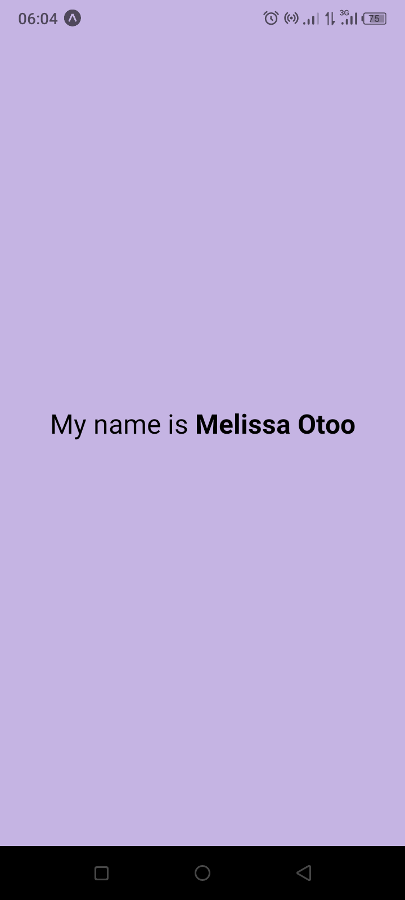

Task Description

The name of my project is Muse. This project was created by running a new React Native blank template project using Expo CLI. . In the `App.js` file, the background color of the main `View` component was changed and adjustments were made to  the `Text` component to display a message containing my name with a bigger font size in bold. 

STUDENT ID 

11263472

